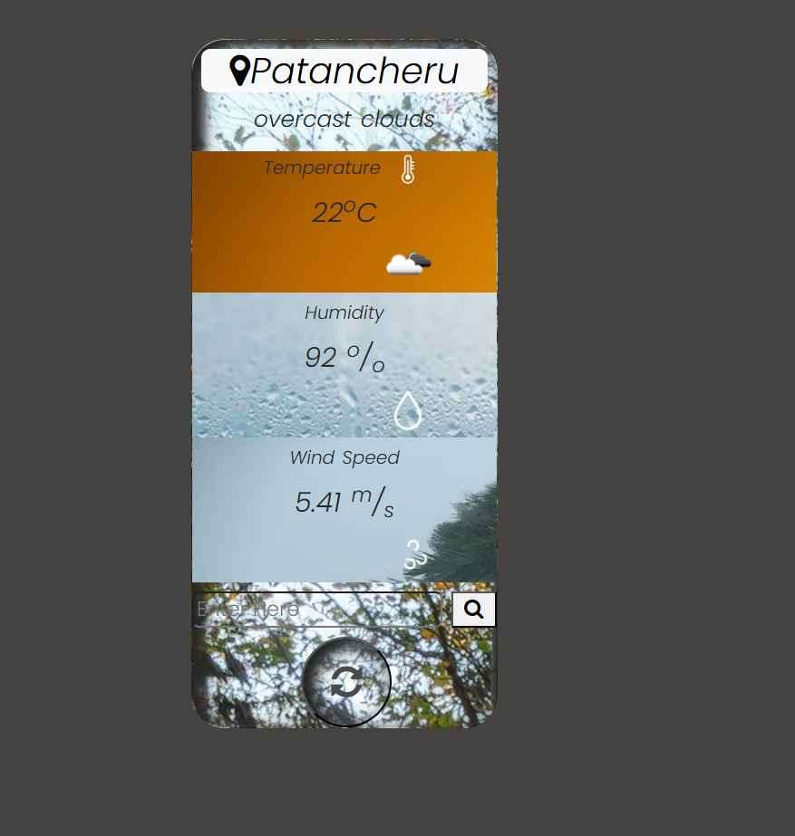

# Weather Application

## Objective

This project focuses on building a weather application that utilizes the OpenWeatherMap API. The application will present weather data in a visually appealing CSS card format, showcasing detailed information such as current temperature, humidity levels, wind speed, and weather icons. Users can refresh the weather information through a dedicated button, ensuring the display remains accurate and up-to-date.

## Project Requirements

- Weather Data Display: 
  - Display key weather data, including temperature, humidity, wind speed, and relevant weather icons.

- Responsive Design: 
  - Ensure the weather application is responsive and functions seamlessly across different devices and screen sizes.

- Refresh Button: 
  - Implement a refresh button that allows users to fetch the latest weather data from the OpenWeatherMap API.

- Visual Appeal: 
  - Utilize CSS cards to display the weather information in an organized and visually appealing manner.

- Separate Files and Clean Code: 
  - Organize the project such that each component has its own separate file for better readability and maintainability.

- Semantic Tags: 
  - Use semantic HTML tags to enhance accessibility and SEO.

- CSS Units: 
  - Avoid using pixel units; employ em, rem, or viewport units for all CSS styles.

## Technology Stack

- HTML5: For structuring the application and utilizing semantic tags.
- CSS3: For styling the application and creating responsive layouts using cards.
- JavaScript: To handle API requests, dynamically update the UI based on user interactions, and manage application logic.
- OpenWeatherMap API: For fetching real-time weather data.

## Installation

1. Clone the Repository:
   ```bash
   git clone https://github.com/vikrambagali/Assignment-6

### Navigate to the Project Directory:
```bash
cd weather-app
```
**Open the index.html File:**

Open index.html in your preferred web browser to view the application. Make sure to have an internet connection for API access.

## 📷 Screenshots 

Example:  



---


## Usage

**View Current Weather:**
- The application loads the current weather data for a default location on startup.

**Refresh Weather Data:**
- Click the refresh button to fetch the latest weather data.

**Responsive Display:**
- Resize the browser window to see how the application adapts to different screen sizes.


## Code Structure

- index.html: Main HTML file containing the structure of the web application.
- styles.css: CSS file for styling the application, following the required units and responsive design principles.
- script.js: JavaScript file that handles API requests and UI updates.
- Separate files for any additional components/modules to maintain clean and organized code.
- Requirements for OpenWeatherMap API
- Users must sign up for a free account at OpenWeatherMap to obtain an API key, which is necessary for making API calls.


## Acknowledge
- This project draws inspiration from various sources on modern web development practices and the use of APIs in applications.


## Contact

**For questions or suggestions, feel free to contact me at** - 28vikram20@gmail.com

## License

**This project is licensed under the MIT License - see the LICENSE file for details.**

1. Netlify Deploy Link:
   ```bash
   https://apiprojectt.netlify.app/

-----------=============-------------
2. Netlify Deploy Link: -2-Same But Different
```bash
https://forcast-api.netlify.app/
```
